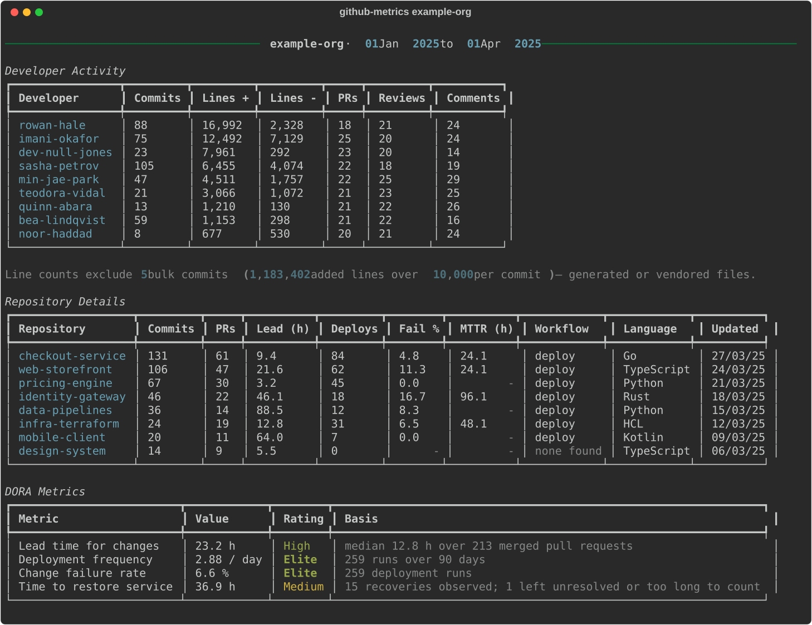

# GitHub Organization Metrics

A command-line tool that measures how a GitHub organization actually delivers software: who contributes, which repositories are busy, and where the [DORA metrics](https://dora.dev/) land.

[](https://github.com/rgilks/github-org-metrics/actions/workflows/ci.yml)




> The example above is generated from synthetic data by `scripts/generate_report_image.py`.

## What it measures

### Developer activity

Commits, lines added and deleted, pull requests opened, reviews given, and review comments — per person, over the chosen window.

Bot accounts are excluded. So are contributors who changed no lines, unless you pass `--include-inactive` (useful when you care about reviewers). Anyone above 100,000 added lines is moved to a separate outliers table, because a single vendored dependency or generated file otherwise dominates every other row; adjust with `--outlier-threshold`.

### Repository activity

Commits, pull requests, lead time, deployment counts and failure rate, mean time to restore, primary language, branch and contributor counts. Repositories with no activity in the window are omitted.

### DORA metrics

| Metric | How it is derived here |
|--------|------------------------|
| **Lead time for changes** | Hours from the first commit on a pull request's branch to the merge |
| **Deployment frequency** | Runs of the repository's deployment workflow, per day |
| **Change failure rate** | Share of those runs that concluded in failure |
| **Time to restore service** | Hours from a failed run to the next successful one |

Each is rated against the published DORA bands (Elite / High / Medium / Low). See [Accuracy and limitations](#accuracy-and-limitations) for what these approximations can and cannot tell you.

## Installation

Requires [uv](https://docs.astral.sh/uv/) and Python 3.12+.

```bash
git clone https://github.com/rgilks/github-org-metrics.git
cd github-org-metrics
uv sync
```

### Create a token

Create a [fine-grained personal access token](https://github.com/settings/tokens?type=beta) with read-only access to the organization:

| Scope | Permission | Access |
|-------|------------|--------|
| Repository | Actions | Read-only |
| Repository | Contents | Read-only |
| Repository | Metadata | Read-only |
| Repository | Pull requests | Read-only |
| Organization | Members | Read-only |

Then export it:

```bash
export GITHUB_TOKEN=your_token_here
```

`GH_TOKEN` is also accepted, so an existing `gh` CLI setup works. No token is needed when reading from the cache.

## Usage

```bash
uv run github-metrics <organization> [options]
```

Analyse the last three months:

```bash
uv run github-metrics my-org
```

### Examples

Look further back:

```bash
uv run github-metrics my-org --months 6
```

Keep a first run on a large organization cheap:

```bash
uv run github-metrics my-org --repos 10 --fast
```

Narrow to specific repositories:

```bash
uv run github-metrics my-org --target-repos api-service web-app
```

Re-analyse cached data with logins hidden:

```bash
uv run github-metrics my-org --use-cache --anonymize
```

### Options

| Option | Description | Default |
|--------|-------------|---------|
| `--months N` | Calendar months to analyse | 3 |
| `--days N` | Days to analyse, instead of `--months` | - |
| `--repos N` | Analyse only the N most recently active repositories | all |
| `--target-repos A B C` | Analyse specific repositories by name | - |
| `--fast` | Skip per-pull-request reviews, comments, and branch history | off |
| `--workers N` | Concurrent API requests | 8 |
| `--output-dir DIR` | Where to write CSVs and the cache | current directory |
| `--no-csv` | Skip writing CSV files | off |
| `--export-svg FILE` | Also save the console report as an SVG image | - |
| `--anonymize` | Replace logins with stable pseudonyms everywhere | off |
| `--outlier-threshold N` | Added-line count above which a contributor is listed separately (0 disables) | 100,000 |
| `--include-inactive` | Include contributors who changed no lines | off |
| `--use-cache` | Analyse cached data instead of calling the API | off |
| `--update-cache` | Fetch fresh data and rewrite the cache | off |
| `--no-cache` | Do not write a cache file | off |
| `-v`, `--verbose` / `-q`, `--quiet` | Raise or lower log detail | - |

## Output

Three CSV files are written alongside the console report.

**`<org>_github_developer_metrics.csv`** — Developer, Commits, Lines Added, Lines Deleted, PRs Opened, PRs Reviewed, PR Comments, Repositories.

**`<org>_github_outliers.csv`** — the same columns, for contributors above the outlier threshold. Only written when there are any.

**`<org>_github_repository_metrics.csv`** — Repository, Commits, PRs, Lead Time (h), Deploys, Fail %, MTTR (h), Deploy (m), Created, Updated, Language, Branches, Contributors.

`--anonymize` applies to the CSVs as well as the console, so an anonymised run leaks no logins anywhere.

## Caching

Raw API responses are cached to `<org>_github_data_cache.json`, which makes re-analysis instant and offline:

```bash
uv run github-metrics my-org --use-cache --months 1
```

The cache records the window it was fetched for. Asking for a wider window than the cache covers produces a warning rather than a quietly incomplete report — re-run with `--update-cache` to refill it.

## Cost and speed

A full run is dominated by two per-item endpoints: one request per commit for line counts, and up to three per pull request for reviews, comments, and branch history. These are issued concurrently (`--workers`), and pagination stops as soon as it walks past the window.

`--fast` skips the per-pull-request calls entirely. Reviews and comments are then reported as `N/A`, and lead time falls back to each pull request's creation date, which understates it by however long the branch existed beforehand.

The tool waits out primary rate limits, honours `Retry-After` on secondary ones, and retries transient server errors with backoff, so a long run survives being throttled.

## Accuracy and limitations

- **Deployments are inferred, not observed.** GitHub has no universal notion of a deployment, so the busiest deployment-shaped workflow (`deploy`, `release`, `publish`, else `ci`/`cd`/`build`/`test`) on the default branch stands in for one. A repository that deploys outside GitHub Actions reports no deployments.
- **Lead time excludes branches older than 90 days.** They are real, but they are not what the metric is trying to describe.
- **Line counts come from GitHub's own commit stats** and include whatever was committed — generated files, vendored dependencies, and large reformats all count. That is what the outliers table is for.
- **Commits are counted on the default branch only**, which is what the commits endpoint returns.
- **Lines changed is not productivity.** Neither is commit count. These numbers are useful for seeing where activity and review load are concentrated; they make poor performance targets, and they will be gamed if used as such.

## Development

```bash
uv run pytest
```

```bash
uv run ruff check . && uv run ruff format --check . && uv run mypy
```

A [pre-commit](https://pre-commit.com/) config runs the same lint and format checks on commit:

```bash
uv run pre-commit install
```

The layout keeps the analysis testable without a network:

| Module | Responsibility |
|--------|----------------|
| `client.py` | GitHub REST access: pagination, retries, rate limits |
| `collect.py` | Which endpoints to call, and concurrency |
| `analyze.py` | Pure aggregation of raw payloads into metrics |
| `dora.py` | DORA performance bands |
| `report.py` | Console tables and CSV export |
| `cache.py` | Versioned on-disk cache |
| `cli.py` | Argument handling and orchestration |

Regenerate the README image after changing the console output:

```bash
uv run scripts/generate_report_image.py
```

## Troubleshooting

**"GitHub rejected the token (401)"** — the token is missing, expired, or malformed. Re-export `GITHUB_TOKEN`.

**"Permission denied" warnings** — the token lacks a scope for that endpoint. Metrics depending on it report no data; the rest of the run continues.

**"Repositories not found or inaccessible"** — the names passed to `--target-repos` do not exist in the organization, or the token cannot see them.

**A metric shows "no data"** — nothing was observed to measure it, as opposed to a value of zero. Deployment metrics need a GitHub Actions workflow; lead time needs merged pull requests.

## License

[MIT](LICENSE).

## References

- [DORA research program](https://dora.dev/research/)
- [GitHub REST API documentation](https://docs.github.com/en/rest)
- [Fine-grained personal access tokens](https://docs.github.com/en/authentication/keeping-your-account-and-data-secure/managing-your-personal-access-tokens#creating-a-fine-grained-personal-access-token)
